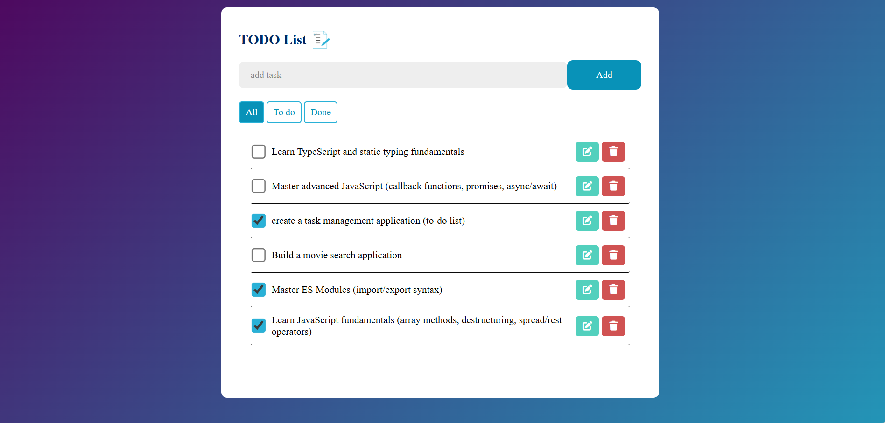
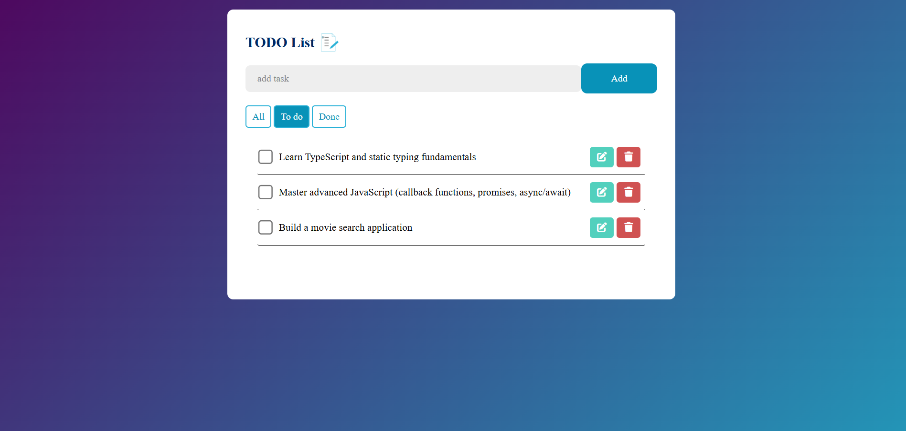
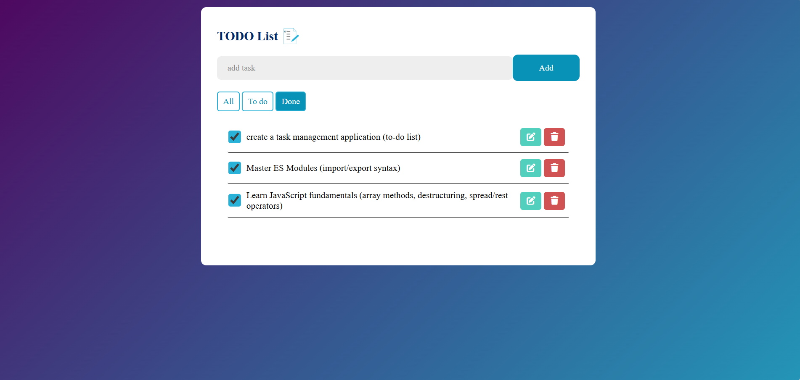

# 📝 JavaScript To-Do-List

A task management application built with **Vanilla JavaScript (ES6+)** as part of my journey toward becoming a **JavaScript Front-End Developer**.

This project focuses on practicing core JavaScript concepts such as **DOM manipulation, object-oriented programming, ES6 modules, Custom Events, Modern methods of tables, Arrow function, Error Handling , and LocalStorage**.

---

# 🚀 Features

- [x] Add a task
- [x] Delete a task
- [x] Mark a task as completed
- [x] Filter tasks
- [x] real-time task filter
- [x] Automatic task persistence using **LocalStorage**
- [ ] Edit a task (coming soon)
- [ ] Drag and drop tasks (coming soon)

---

# 🛠 Technologies

- HTML
- CSS
- JavaScript (ES6+)
- LocalStorage API

---

# Project overview

## 📸 Screenshots






## 🚀 Live Demo

[demo TO-DO-List](https://le-prince-fouda.github.io/Javascript-fundamentals/TO-DO-List/)

---

# 🧠 JavaScript Concepts Practiced

This project demonstrates the use of several important JavaScript concepts.

## 1. DOM Manipulation

Used to dynamically update the user interface.

Examples:

- `querySelector`
- `createElement`
- `appendChild`
- `classList`
- `addEventListener`

```javascript
//from script.js
const taskList = document.querySelector('.task-list ul')
//...
const task = new TodoItem(inputBox.value)
taskList.prepend(task.element)
```

```javascript
//from dom.js
function createElement(tagName, attributes= {}){
    //we create an element with his tagname
    const element = document.createElement(tagName)
    //we add to the created element all his indicated attributes 
    for (const [attribute, value] of Object.entries(attributes)){
        element.setAttribute(attribute, value) // assigning values to attributes
    }
    return element
}
```

---

## 2. Object-Oriented Programming

The application logic is structured using **JavaScript classes**.

Purpose:

- organize code
- encapsulate logic
- make the project easier to maintain

Example:

```javascript
//From TodoList.js
class TodoItem {
    /**HTMLElement */
    #element
    constructor(todo){
         const todoID = todo.replaceAll(" ", ""); //Remove all spaces inside and outside the character string.
        const li = createElement('li')
        //...
        this.#element = li
        //...

    }
    //...
}
```

---

## 3. JavaScript Modules (ES6)

The project is organized using **import/export** modules.

Example:

```javascript
//from dom.js
export function createElement(/*...*/){
    //...
}

//from TodoList.js
import { createElement } from "./functions/dom.js"
```

## 4. Custom Events

**Concept:** Implementing a "Publish/Subscribe" communication system to isolate components.

**Application:** I used custom events to notify the main script when a task is deleted. This allows the TodoItem class to remain entirely independent of the storage logic (decoupling).

```JavaScript
// Dispatching from TodoList.js
const event = new CustomEvent('delete', {
            detail: this.#todo,
            bubbles: true,
            cancelable: true
        })
this.#element.dispatchEvent(event)
//if the "delete" event is call with "preventDefault", we do nothing
if(event.defaultPrevented){
    return
}

// Centralized handling in script.js
taskList.addEventListener('delete', ()=> {
    setTimeout(() => update(), 0)
})
```

## 5. Modern Array Methods (Functional Programming)

**Concept:** Using declarative methods `map()`, `filter()`, `forEach()`, `Array.from()` to handle data collections cleanly.

**Application:** Instead of traditional for loops, I used .map() to serialize the DOM state into a structured JSON object, making data persistence seamless.

```JavaScript
//from scipt.js
// Fluidly transforming the DOM into structured data
const todosData = Array.from(taskList.children).map(li => {
        return {
            title: li.querySelector('label').innerText,
            completed: li.classList.contains('completed') 
        };
    });
```

## 6. Lexical Scoping with Arrow Functions

**Concept:** A concise function syntax that automatically preserves the context of the this keyword.

**Application:** They are particularly useful in event listeners to ensure that this still refers to the current class instance.

```JavaScript
// from TodoList.js
// 'this' remains bound to the TodoItem class instance
 checkbox.addEventListener('change', (e) => {
            this.toggle(e.currentTarget)
        })
```

## 7. Error Handling (try...catch)

**Concept:** `try...catch` is used to safely handle potential errors and prevent the application from crashing.

**Application:** In this project, it is used when reading data from LocalStorage to handle cases where the stored data might be corrupted or improperly formatted.

```javascript
//from script.js
try {
    const savedtodos = JSON.parse(todosInStorage);
    //...
} catch (e) {
    console.error('An error appear by reading localstorage')
}
```

## 8. LocalStorage
**Concept:** LocalStorage is a Web API that allows data to be stored persistently in the user's browser.

**Application:** It is used to save and retrieve the task list so that tasks remain available even after refreshing the page.

```javascript
//from script.js
const update = () => {
     // ...
    localStorage.setItem('todos', JSON.stringify(todosData));
};

const todosInStorage = localStorage.getItem('todos')
```
